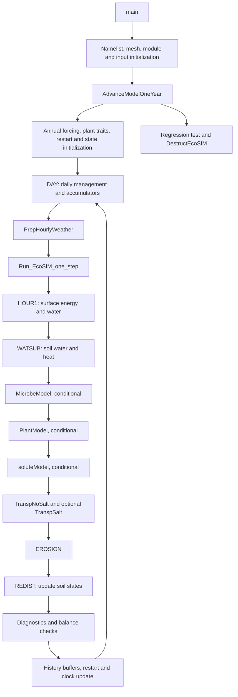

# EcoSIM searchable calling sequence

Open `ecosim_call_graph.html` in a browser. Search by procedure, module, subsystem, or source path. Selecting a node shows its definition, callers, callees, call sites, and possible dispatch targets.

- tracked EcoSIM source commit: `4c901fa47ee34217582f03b9c7c2018035e9b5d8`
- source branch: `main`
- source worktree state: `dirty; the graph may include uncommitted source changes`
- internal procedures: `1464`
- call edges: `10502`
- source files: `188`

## Tracked EcoSIM revision

This calling graph was generated from EcoSIM commit `4c901fa47ee34217582f03b9c7c2018035e9b5d8` on branch `main`. The source worktree was `dirty; the graph may include uncommitted source changes` when indexed. When the state is dirty, the commit identifies the baseline revision, but the graph can also reflect local source edits that are not contained in that commit.

## Top-level execution sequence



The executable entry is `drivers/ecosim/ecosim.F90:1`. The annual loop is in `drivers/ecosim/EcoSIMAPI.F90:326`, and the ordered process step is in `drivers/ecosim/EcoSIMAPI.F90:36`.

Machine-readable indexes are `ecosim_call_graph.json`, `procedures.csv`, and `calls.csv`. `ecosim_call_graph.dot` contains the entry-point-reachable graph for Graphviz-compatible tools.

Rebuild or search from the repository root:

```bash
python3 Tools/build_fortran_call_graph.py \
  --source-root /Users/jinyuntang/work/github/ecosim_workspace/main/f90src \
  --driver-root /Users/jinyuntang/work/github/ecosim_workspace/main/drivers/ecosim \
  --output-dir code_analysis/ecosim_call_graph

python3 Tools/build_fortran_call_graph.py \
  --source-root /Users/jinyuntang/work/github/ecosim_workspace/main/f90src \
  --driver-root /Users/jinyuntang/work/github/ecosim_workspace/main/drivers/ecosim \
  --output-dir code_analysis/ecosim_call_graph --query PlantModel
```

This is static analysis. Runtime flags, preprocessing, generic interfaces, procedure pointers, and type-bound dispatch can change the executed sequence. Unresolved calls remain marked instead of being silently assigned.
